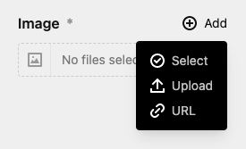

# Kirby Files From Url

## Overview

Upload a files (images, video, documents) from url. Direct from the files field.

> WARNING: This Plugin overrides the files field. Don't mix it with other Plugin, that doing the same.

> This plugin is free to use and published under the MIT license. If you use this plugin for commercial purposes, or you want to show your appreciation. [support me with a donation](https://license.microman.ch/?product=904955).

## Installation

**Manually**

[Download](https://github.com/youngcut/kirby-files-from-url) and copy the plugin into your plugin folder: `/site/plugins/`

**With Composer**

`composer require microman/kirby-files-from-url`

## License

MIT

> Do You like this Plugin? [Buy me a ☕️](https://license.microman.ch/?product=904955)