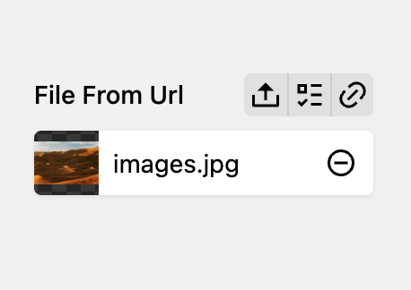

# Kirby Files From Url

## Overview

Upload a files (images, video, documents) from url. Direct from the files field.

> WARNING: This Plugin overrides the files field. Don't mix it with other Plugin, that doing the same.

## Installation

**Manually**

[Download](https://github.com/plain-solutions-gmbh/kirby-files-from-url) and copy the plugin into your plugin folder: `/site/plugins/`

**With Composer**

`composer require plain/kirby-files-from-url`

# License

This plugin is free to use and is published under the MIT license. If you use this plugin for commercial purposes or wish to show your appreciation, [support me with a donation](https://www.paypal.com/donate/?hosted_button_id=9F58LDZYW763W).
